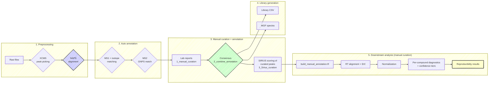

# HUMAN Ring Trial

This repository contains the analysis for the **Ring Trial study**, part of
the **HUMAN Doctoral Network's** main research efforts.

## 📖 Study Overview

The goal of this study is to understand the sources of variability between
different LC-MS setups used in metabolomics. We compare multiple LC-MS methods
across the participating laboratories (Afekta, Cembio, HMGU, ICL).

**Experimental design:**

1. **Lab-specific method** — each lab analyses the mixtures with its standard,
   everyday LC-MS protocol.
2. **HUMAN reference method** — all labs analyse the same mixtures with a
   standardized method (common column and gradient).
3. **Samples** — mixtures from the MetaSci metabolite standard library, so the
   ground-truth composition of each mixture is known.

> **This branch is the semi-automated (expert-curated) track.** Labs manually
> review the automatic evidence, SIRIUS scores the human-curated peaks, and the
> downstream analysis quantifies cross-lab reproducibility of the confirmed
> panel. The **fully automatic all-MS2 SIRIUS annotation** and the
> **spectral-library building** it feeds live on the `main` branch, which carries
> its own README.

-----

## 📂 Project Structure & Workflow

The analysis is organized as numbered folders, run in order. The end product is
the **manually-curated annotation** of the spike-in panel and a **cross-lab
reproducibility analysis** built on it.

```mermaid
---
config:
  look: handDrawn
---
graph LR
    subgraph "1. Preprocessing"
        A[Raw files] --> B{XCMS<br>peak picking};
        B --> C{NAPS<br>alignment};
    end
    subgraph "2. Auto annotation"
        C --> D{MS1 + isotope<br>matching};
        D --> E{MS2<br>GNPS match};
    end
    subgraph "3. Manual curation + annotation"
        E --> F[Lab reports<br>1_manual_curation];
        F --> G{Consensus<br>2_combine_annotation};
        G --> SI[SIRIUS scoring of<br>curated peaks<br>3_Sirius_curation];
    end
    subgraph "4. Library generation"
        G --> I[Library CSV];
        G --> J[MGF spectra];
    end
    subgraph "5. Downstream analysis (manual curation)"
        SI --> BLD[build_manual_annotation.R];
        BLD --> RT[RT alignment + EIC];
        RT --> NORM[Normalization];
        NORM --> DIAG[Per-compound diagnostics<br>+ confidence tiers];
        DIAG --> REP[Reproducibility results];
    end

    style C fill:#ccf,stroke:#333,stroke-width:2px
    style G fill:#cfc,stroke:#333,stroke-width:2px
    style REP fill:#ffc,stroke:#333,stroke-width:2px
```

### 🔹 1. Preprocessing (`1_preprocessing/`)

*Goal: convert raw data into processed xcms objects.*

  * `generic_preprocessing.qmd` — template preprocessing script; `setup.R` loads
    packages and definitions.
  * `standards.xlsx` & `NAPS_info.xlsx` — MetaSci panel and NAPS anchor details.
  * **Lab folders** (`afekta`, `cembio`, `hmgu`, `icl`) each contain a
    `HE` (human-extract / standardized method) subfolder with the lab-specific
    `preprocessing_script.qmd`, sequence tables, `naps.csv`, and the xcms
    objects. Raw mzML and the heavy xcms objects are not tracked (see below).

### 🔹 2. Automatic Annotation (`2_annotation_auto/`)

*Goal: generate initial evidence for metabolite identification.*

Uses the preprocessed objects to match MS1 adducts, isotopes, and MS2 spectra
against libraries, producing the per-lab evidence tables consumed in Step 3.

### 🔹 3. Manual Curation & Annotation (`3_annotation_manual/`)

*Goal: turn the automatic evidence into an expert-verified, cross-lab panel
annotation.*

1. **Manual curation (`1_manual_curation/`)** — labs review the automatic
   evidence (`lab_report/`); `fixed_lab_report/` standardizes formatting.
2. **Combine annotation (`2_combine_annotation/`)** — `compare_lab_sheet.R`
   merges the per-lab corrections into `all_lab_annotations.xlsx` and
   `consensus_lab_annotations.xlsx`. Labs review flagged compounds and
   re-integrate missing ones.
3. **SIRIUS scoring of the curated peaks (`3_Sirius_curation/`)** —
   `sirius_annotation.qmd` runs SIRIUS (formula ID + structure DB + COSMIC) on
   the **manually-curated peaks** — i.e. SIRIUS only *scores* peaks experts
   already identified; the identity is human-assigned. Per-lab output:
   `*_lab_annotations_sirius_curated.xlsx` (curated `compound`, `adduct`,
   `chrom_peak_id`, `rtmed`, per-adduct m/z, `into`, `best_structurePerIdRank`,
   `best_ConfidenceScoreExact`). `curated_annotation_all_labs.qmd` consolidates
   them. This expert-verified set (all four labs) is the basis for the
   downstream reproducibility analysis.

### 🔹 4. Library Generation (`4_library_generation/`)

*Goal: produce the final spectral libraries.*

`lib_gen_HE.qmd` (run per lab) writes `ring_trial_library_HE.csv` (library
table) and `std_spectra_HE.mgf` (MS/MS spectra).

### 🔹 5. Downstream Analysis (`5_downstream_analysis_manual/`)

*Goal: quantify cross-lab reproducibility of the **SIRIUS-confirmed,
manually-curated** spike-in panel, and produce the ring-trial comparison numbers
(variance decomposition, ICC ladder, pairwise agreement, per-compound
diagnostics).*

This track is **self-contained**: it bundles its own copy of the shared helper
code (`helpers.R`, `annotated_eic_pipeline.R`) **and the annotation-independent
builders** that produce its inputs, so it does not depend on any other analysis
folder. Render order matters (producer → consumer):

  * **Builders (annotation-independent infrastructure):**
      * **`1_full_detected_objects.qmd`** — builds the Full/Detected signal
        objects (`bpc_*` / `tic_*`) from the preprocessed `Spectra`.
      * **`2_naps_extraction.qmd`** — SNR-aware chromExtract on the NAPS anchor
        injections → `object/naps_chrom_metrics.csv`.
      * **`4_consensus_peaks.qmd`** — NAPS-aligned cross-lab matching of the
        per-lab xcms peaks → `object/peak_metrics_detected_all4labs.csv`
        (+ `ct_all_samples`, `tic_consensus`).
    These read the heavy preprocessed objects (raw mzML, the 9.7 GB `sp_*.RData`),
    which are local-only; their small outputs are tracked so the analysis below
    runs without them.
  * **`build_manual_annotation.R`** — converts the curated
    `*_lab_annotations_sirius_curated.xlsx` into the two canonical inputs:
    `object/feat_rts.csv` (per feature) and `object/annotation_identity.csv`
    (per compound: COSMIC, structure rank, adducts).
  * **`3_rt_alignment.qmd`** — **fits** the per-`(lab, polarity)` NAPS monotonic
    splines from `naps_chrom_metrics.csv` (writing `rt_alignment_splines.RData` +
    `rt_alignment_anchors.csv`), maps each lab's apex RT onto a cross-lab
    consensus axis, then re-extracts an SNR-aware EIC over every curated peak →
    `object/annotation_chrom_metrics.csv` (with the cross-lab-comparable
    `aligned_rt`). MS1 anchoring is skipped — the curated `rtmed` is already the
    chromatographic apex. Also reports the alignment QC (within-lab floor,
    NAPS-vs-consensus drift, before/after cross-lab RT spread).
  * **`5_normalization.qmd`** — fits per-`(lab, sample, polarity, decile)`
    intensity factors (Global / Decile / LOESS) on the detected peaks, applies
    them to the annotated peaks, and compares normalization strategies by bulk
    ICC (incl. the pairwise-ICC heatmap).
  * **`8_per_compound_diagnostics.qmd`** — identity / retention / abundance
    diagnostics per compound, and assigns the **A/B/C/D confidence tiers**
    (max COSMIC across labs × cross-lab aligned-RT SD). The whole QMD is
    restricted to **SIRIUS-confirmed** compounds (`best_structure_rank` not NA).
  * **`7_reproducibility_results.qmd`** — the headline reproducibility report:
    variance decomposition and an ICC ladder across the data-level progression
    (Full → Detected → Consensus → **Annotated (MS2)** → **Annotated + MS1**),
    plus pairwise ICC and per-compound Spearman ρ across lab pairs. The two
    annotated levels separate the MS2-only signal (`source = "own"`) from the
    MS2 + MS1-rescue signal (`source = "own"` + `"consensus"`).

-----

## 🗃️ What is (and isn't) in the repository

The repository tracks the **analysis code** plus the **curated annotation** and
the **small canonical CSVs** the downstream QMDs consume. Large intermediates,
raw data, and machine-built caches are kept local (regenerated, or shared
out-of-band).

**Tracked:** all `.qmd` / `.R` analysis code; the curated SIRIUS annotation
(`*_lab_annotations_sirius_curated.xlsx`); and only the `object/` CSVs that are
**expensive to compute or cannot be regenerated within the track** —
`annotation_chrom_metrics.csv` (the SNR-aware EIC output, ~15 min + raw mzML),
plus the external precomputed inputs `naps_chrom_metrics.csv`,
`peak_metrics_detected_all4labs.csv`, and `rt_alignment_anchors.csv`.

**Not tracked (local only):**

| Pattern | Why excluded |
|---|---|
| `*.mzML`, `*.raw`, `*.wiff`, `*.d/` | Raw instrument data — obtain per-lab from the original acquisitions. |
| `*.html`, `*_cache/`, `.quarto/` | Rendered reports / caches — re-render from the QMDs (`quarto render <file>.qmd`). |
| `*.RData`, `*.rds` | `Spectra` / `Chromatograms` / pipeline caches built from raw mzML (incl. the NAPS splines and the Full/Detected/Consensus signal objects). |
| `*.sirius`, `results_all_ms2/`, `results_consensus_all/` | SIRIUS project files and per-run caches — the aggregated result lands in the tracked curated xlsx. |
| `detected_peaks_*_HE.csv`, `ct_all_samples.csv` | Large per-lab peak tables / consensus sample matrix (tens of MB each). |
| `feat_rts.csv`, `annotation_identity.csv`, `*_normalized.csv`, `detected_peak_counts.csv`, `normalization_winners.csv` | Easy-to-recompute intermediates — `build_manual_annotation.R` regenerates the first two from the curated xlsx in seconds; the others are produced by re-running `5_normalization.qmd` / the diagnostics. |

Because the heavy intermediates (the `.RData` NAPS splines and Full/Detected/
Consensus objects, and the large peak tables) are local-only, a fresh clone has
the full analysis **code** and the small canonical CSVs, but re-rendering the
complete chain from scratch requires those intermediates (regenerated locally
from the raw data, or shared on request).

## 📊 Comparison Logic

The downstream analysis quantifies cross-lab reproducibility across a
**data-level progression**, from raw chromatograms through the SIRIUS-confirmed
panel. Each level answers a different question; together they show where
cross-lab variance comes from and how much identity-anchoring recovers.

| Level | What | Output |
|---|---|---|
| **Full** | All MS1 ions, no peak detection | `bpc_full` / `tic_full` (local) |
| **Detected** | Per-injection xcms peaks | `detected_peaks_{lab}_HE.csv` (local) |
| **Consensus** | Cross-lab matched features (NAPS-aligned) | `peak_metrics_detected_all4labs.csv` |
| **Annotated (MS2)** | SIRIUS-confirmed panel, MS2-identified peaks only | `annotation_chrom_metrics_normalized.csv` |
| **Annotated + MS1** | Same panel, adding MS1-rescued peaks at the consensus RT | `annotation_chrom_metrics_normalized.csv` |

Lab effect dominates the raw (Full) level and drops sharply by the Annotated
levels — the ring trial's headline finding that identity-anchored analysis
substantially recovers cross-lab comparability.
