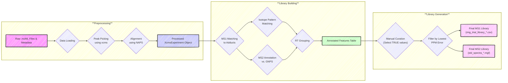
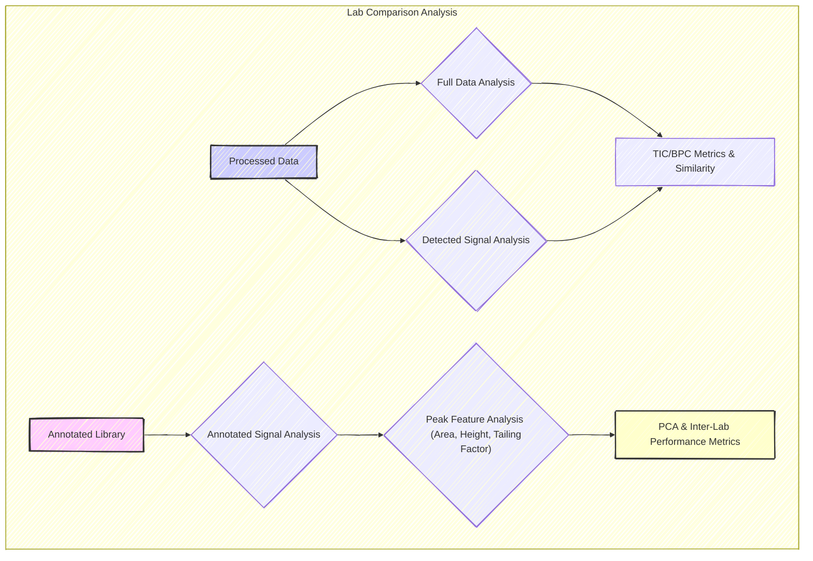

# HUMAN_Ring_Trial

This repository contains the analysis for the **Ring Trial study**, which is
part of the HUMAN Doctoral Network's main research efforts.

## Study Overview

The goal of the study is to better understand the sources of variability between
different LC-MS setups used in metabolomics. Specifically, we compare multiple
LC-MS methods across various laboratories:

1.  **Lab-Specific Method**: Each participating lab analyzes mixtures using
    their own standard, everyday LC-MS protocol.
2.  **HUMAN Reference Method**: All labs also analyze the same mixtures using a
    standardized method, with a common column and gradient.

### Experimental Design

-   A total of **83 mixtures** from the MetaSci metabolite standard library will
    be analyzed by each lab.
-   Each mixture is measured **twice**:
    -   Once using the **lab-specific method**
    -   Once using the **HUMAN reference method**

Because the ground truth (i.e., the identity and number of metabolites) is
known, we can: 

- Compare chromatographic methods **within** each lab 
- Compare LC-MS setups **between** labs using the standardized method

## Project Structure

The first phase focuses on **automating the library-building process** as much
as possible.

### Preprocessing

-   Each lab will have their own **preprocessing scripts**.
-   These scripts generate intermediate objects required for library
    construction.
-   While preprocessing files are quite similar across labs, **they must be run
    step by step**, as intermediate outputs will help determine necessary
    parameters for the library.
- The preprocessing will results with a save "mse" (and possible "mse2") 
  which are the preprocessed XcmsExperiment objects. These are resued throughout 
  the rest of the process described below. 

### Library Building

-   The **library-building scripts are shared and common** across all labs.
-   They take the preprocessed objects as input and produce:
    -   **Two final CSV files**
    -   **Several diagnostic plots** to support decision-making and resolve
        ambiguities in metabolite identification.

> ⚠️ **Note:** The intermediate outputs from the library-building scripts are
> not intended for direct use or inspection. Only the **final CSVs and plots**
> are relevant for library review and finalization.

- Library generation is in a `lig_gen_*.qmd` file will results in 2 files: 
  - A `ring_trial_library_*.csv` file containing the generated library, 
    with identified metabolites and their characteristics.
  - A `std_spectra_*.mgf` file containing the MS/MS spectra of the identified 
    metabolites in MGF format.
      - This one is to be refined in some ways.

## Example and Generic Files

To support users in adapting the pipeline to their own data, we provide:

-   **Example lab folder**:

    -   `example_preprocessing.qmd`: Step-by-step explanation of the
        preprocessing procedure.
    -   `example_library_building.qmd`: Step-by-step explanation of the
        library-building process.

    These are designed for clarity and learning. And as an example to how each
    lab analysis should be organised.

-   **Generic files**:

    -   `generic_preprocessing.qmd`
    -   `generic_library_building.qmd`
    -   `setup.R`

    These are simplified versions that users can easily adapt to their own
    datasets. They include the necessary logic but omit extensive inline
    commentary and visualization.

## Results 

The downstream lab comparison will be generated in the `results` folder, which
will contain:

    - `lab_comparison.qmd`: A comprehensive comparison of results across all
      participating labs.
    - `figures/`: A directory containing all figures generated during the lab
      comparison analysis.
    - `rt_analysis_function.R`: A script containing functions used in the lab
      comparison analysis.
    - `objects/`: A directory for storing intermediate objects used in the lab
      comparison analysis.

