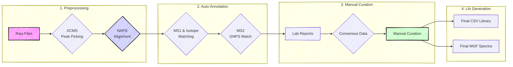
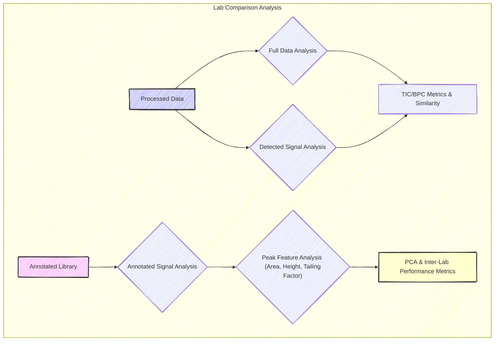

# HUMAN Ring Trial

This repository contains the analysis for the **Ring Trial study**, part of the **HUMAN Doctoral Network's** main research efforts.

## 📖 Study Overview

The goal of this study is to understand the sources of variability between different LC-MS setups used in metabolomics. We compare multiple LC-MS methods across various participating laboratories (Afekta, Cembio, HMGU, ICL).

**The Experimental Design:**

1.  **Lab-Specific Method:** Each lab analyzes mixtures using their standard, everyday LC-MS protocol.
2.  **HUMAN Reference Method:** All labs analyze the same mixtures using a standardized method (common column and gradient).
3.  **Samples:** A total of **83 mixtures** from the MetaSci metabolite standard library are analyzed (Ground Truth is known).

-----

## 📂 Project Structure & Workflow

The analysis is divided into **5 sequential steps**, each corresponding to a numbered folder in the repository.

### 🔹 1. Preprocessing (`1_preprocessing/`)

*Goal: Convert raw data into processed XCMS objects.*

  * **Generic Files:**
      * `generic_preprocessing.qmd`: A template script for preprocessing.
      * `setup.R`: Loads necessary packages and definitions.
      * `standards.xlsx` & `NAPS_info.xlsx`: MetaSci library and NAPS peak details.
  * **Lab Folders:** Each lab (e.g., `afekta`, `cembio`, `icl`, `hmgu`) has specific subfolders containing:
      * `preprocessing_script.qmd`: The specific execution script.
      * `seq_pos.xlsx`: Sequence files.
      * `naps.csv`: Results of NAPS detection.
      * `mse` and `mse2` objects: XCMS preprocessed R objects.

### 🔹 2. Automatic Annotation (`2_annotation_auto/`)

*Goal: Generate initial evidence for metabolite identification.*

  * **Process:** Uses the preprocessed objects to match MS1 adducts, isotopes, and MS2 spectra against libraries.
  * **Key Output:** `peak_evidence.csv` and `peak_evidence_rt_grouped.csv` (intermediate files used for the next step).

### 🔹 3. Manual Curation (`3_annotation_manual/`)

*Goal: Refine automatic annotations through expert review.*

1.  **Manual Curation (`1_manual_curation`):**
      * Contains `lab_report` files where labs reviewed the automatic data.
      * `fixed_lab_report/`: Scripts to standardize and fix formatting errors in manual reports.
2.  **Combine Annotation (`2_combine_annotation`):**
      * `compare_lab_sheet.R`: Merges the corrections.
      * `consensus_summary.xlsx`: The merged annotations.
3.  **Refinement Loop:**
      * Labs check the consensus results and review flagged compounds.
      * Labs manually integrate missing compounds.
      * Another round of annotation combining is performed to generate a final table for each lab and a final consensus table.

### 🔹 4. Library Generation (`4_library_generation/`)

*Goal: Produce the final, clean spectral libraries.*

  * **Input:** The consensus data from Step 3.
  * **Script:** `lib_gen_HE.qmd` (run per lab).
      * > **Note:** This script is currently being updated.
  * **Final Outputs:**
      * `ring_trial_library_HE.csv`: The final library table.
      * `std_spectra_HE.mgf`: The MS/MS spectra in MGF format.

### 🔹 5. Downstream Analysis (`5_downstream_analysis/`) 🚧 WIP

*Goal: Compare performance across laboratories.*

  * `lab_comparison_HE.qmd`: The main analysis notebook comparing chromatographic performance (peak width, tailing) and identification success between labs.
  * `rt_analysis_function.R`: Helper functions for the analysis.

-----

## 🛠️ Usage

To reproduce the analysis or adapt it to new data, follow the numerical order of the folders.

### For a New Analysis:

1.  **Setup:** Run `1_preprocessing/setup.R` to install dependencies and load helper functions.
2.  **Preprocessing:** Copy `1_preprocessing/generic_preprocessing.qmd` and adapt it to your file paths.
3.  **Annotation:** Run the `generic_automatic_annotation.qmd` located in `2_annotation_auto/` to generate your evidence tables.

### For the Ring Trial Reproduction:

Data is organized by lab (`afekta`, `cembio`, `hmgu`, `icl`) and method (`HE` for Human Extract/Standardized). You must run the `.qmd` file within the specific lab subfolder to regenerate that specific part of the analysis.

> ⚠️ **Note on Intermediate Files:**
> The pipeline generates several intermediate objects (e.g., inside `2_annotation_auto/.../peak_evidence.csv`). These are not final results. Always refer to folder `4_library_generation` for the final libraries, `5_downstream_analysis` for the comparative results, and the **final consensus table in Step 3**.

-----

## 📊 Comparison Logic

The downstream analysis (`5_downstream_analysis`) performs the final assessment of the Ring Trial.

